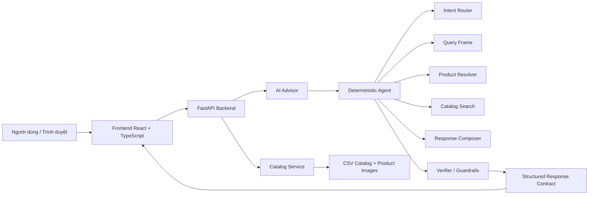

# AURA AI Sales Advisor

AURA AI Sales Advisor là hệ thống thương mại điện tử có trợ lý tư vấn mua sắm bằng AI, tập trung vào sản phẩm công nghệ như laptop và điện thoại. Dự án kết hợp giao diện catalog sản phẩm với một AI Advisor có khả năng hiểu câu hỏi tiếng Việt, lọc sản phẩm theo nhu cầu, giữ ngữ cảnh hội thoại, so sánh sản phẩm và trả lời dựa trên dữ liệu catalog thật.

Điểm quan trọng của dự án là kiểm soát hành vi AI. Trợ lý không trả lời tự do theo mô hình ngôn ngữ, mà đi qua các lớp định tuyến intent, query frame, truy xuất catalog, giải quyết tham chiếu sản phẩm, kiểm chứng câu trả lời và ràng buộc đồng bộ giữa nội dung chat với thẻ sản phẩm.

## Tính Năng Chính

- Hiển thị catalog sản phẩm công nghệ.
- Tìm kiếm và lọc theo hãng, danh mục, giá, CPU, GPU, RAM, SSD, kích thước màn hình và nhu cầu sử dụng.
- Tư vấn mua sắm bằng tiếng Việt.
- Hiểu ngữ cảnh hội thoại như "mẫu đó", "máy này", "2 mẫu vừa hỏi", "cùng tầm giá".
- Phân tích chi tiết một sản phẩm dựa trên dữ liệu catalog.
- Đánh giá sản phẩm theo nhu cầu cụ thể như văn phòng, học tập, gaming hoặc đồ họa nhẹ.
- So sánh sản phẩm bằng dữ liệu có căn cứ.
- Đồng bộ câu trả lời AI với danh sách sản phẩm liên quan trong giao diện.
- Kiểm tra câu trả lời để hạn chế lệch sản phẩm, bịa thông số hoặc kết luận khi thiếu dữ liệu.

## Kiến Trúc Tổng Quan



## Cấu Trúc Thư Mục

```text
.
├── backend/
│   ├── api/              # FastAPI entrypoint và route API
│   ├── agent/            # Intent router, query frame, resolver, composer, verifier
│   ├── services/         # Catalog, conversation, ranking, observability
│   ├── harness/          # Runtime, governance, fallback, trace, preflight/postflight
│   ├── retrieval/        # Các thành phần truy xuất dữ liệu
│   ├── verification/     # Workflow và tiện ích kiểm chứng
│   └── workflows/        # Research/sales workflow
│
├── frontend/
│   ├── src/
│   │   ├── components/   # Storefront, copilot drawer, UI components
│   │   ├── stores/       # Zustand stores
│   │   ├── types/        # TypeScript contracts
│   │   ├── lib/          # Tiện ích frontend
│   │   └── data/         # Dữ liệu/hằng số phía client
│   └── package.json
│
├── data/                 # Catalog, ảnh sản phẩm, dữ liệu chính sách
├── docs/                 # Tài liệu thiết kế và triển khai
├── scripts/              # Script crawl/enrich/validate catalog
├── tests/                # Unit, integration, API contract và regression tests
├── requirements.txt      # Dependency Python
├── docker-compose.yml    # Cấu hình chạy bằng Docker
├── Dockerfile.backend
├── Dockerfile.frontend
└── README.md
```

## Yêu Cầu Môi Trường

- Python 3.10 trở lên.
- Node.js 18 trở lên.
- npm.
- Git.

Chế độ chạy local mặc định dùng logic catalog có kiểm soát, không bắt buộc phải có API key LLM.

## Cấu Hình Môi Trường

Tạo file `.env` từ mẫu:

```bash
cp .env.example .env
```

Trên Windows PowerShell:

```powershell
Copy-Item .env.example .env
```

Một số biến môi trường thường dùng:

```env
PRODUCT_CATALOG_PATH=./data/product_catalog_real.csv
ENABLE_EXTERNAL_AI_WORKFLOW=false
ENABLE_LLM_DECISION_PHRASING=false
AGENT_SHADOW_MODE=false
EXPOSE_DECISION_TRACE=false
```

Không commit file `.env`, database local, log, cache hoặc API key thật lên GitHub.

## Chạy Dự Án Local

### 1. Cài dependency backend

```bash
pip install -r requirements.txt
```

### 2. Chạy backend

```bash
python -m uvicorn backend.api.main:app --host 127.0.0.1 --port 8000 --reload --reload-dir backend
```

Backend mặc định chạy tại:

```text
http://127.0.0.1:8000
```

### 3. Cài dependency frontend

```bash
cd frontend
npm install
```

### 4. Chạy frontend

```bash
npm run dev
```

Frontend mặc định chạy tại:

```text
http://localhost:5173
```

## Kiểm Tra API Nhanh

Health check:

```bash
curl http://127.0.0.1:8000/health
```

Lấy danh sách sản phẩm:

```bash
curl "http://127.0.0.1:8000/api/products?limit=2"
```

Gửi câu hỏi chat:

```bash
curl -X POST http://127.0.0.1:8000/api/chat \
  -H "Content-Type: application/json" \
  -d "{\"message\":\"Cho tôi laptop Dell dưới 20 triệu\",\"history\":[],\"conversation_state\":null}"
```

Ví dụ câu hỏi nên thử trong giao diện:

- `Laptop học tập dưới 20 triệu`
- `Có laptop Dell nào màn hình 15 inch không?`
- `Phân tích kỹ mẫu 00929021`
- `Máy Lenovo IdeaPad Slim 3 14IPH11 U7 355 (83UQ003PVN) có hợp văn phòng không?`
- `So sánh mẫu 00929021 với các máy cùng tầm giá`

## Chạy Test

Chạy nhóm regression chính cho agent và API:

```bash
python -m pytest tests/test_api_contract_runtime.py tests/test_intent_router_v2.py tests/test_response_composer.py -q
```

Chạy nhóm kiểm tra product facts và tham chiếu sản phẩm:

```bash
python -m pytest tests/test_product_facts.py tests/test_product_reference_resolution.py -q
```

Build frontend:

```bash
cd frontend
npm run build
```

## Chạy Bằng Docker

Nếu đã cấu hình Docker:

```bash
docker compose up --build
```

Dừng container:

```bash
docker compose down
```

## Các Module Backend Quan Trọng

- `backend/api/main.py`: API chính cho frontend, catalog và chat.
- `backend/agent/intent_router.py`: nhận diện ý định người dùng.
- `backend/agent/query_frame.py`: chuẩn hóa bộ lọc và ngữ cảnh truy vấn.
- `backend/agent/product_resolver.py`: giải quyết SKU, tên sản phẩm, mẫu đang focus hoặc sản phẩm vừa nhắc.
- `backend/agent/search_filters.py`: lọc sản phẩm theo constraints.
- `backend/agent/response_composer.py`: tạo câu trả lời có cấu trúc.
- `backend/agent/comparison.py`: tạo bảng so sánh sản phẩm.
- `backend/agent/verifier.py`: kiểm chứng câu trả lời trước khi trả về.
- `backend/agent/domain_contract.py`: các luật hợp đồng nghiệp vụ cho câu trả lời.
- `backend/services/catalog.py`: đọc catalog, ảnh, giá và thông tin sản phẩm.

## Các Module Frontend Quan Trọng

- `frontend/src/components/storefront/`: giao diện catalog và thẻ sản phẩm.
- `frontend/src/components/copilot/`: drawer chat, bubble, bảng so sánh, thẻ sản phẩm inline.
- `frontend/src/stores/copilotStore.ts`: trạng thái chat và gọi API.
- `frontend/src/stores/commerceStore.ts`: trạng thái sản phẩm được chọn, giỏ hàng, so sánh.
- `frontend/src/types/commerce.ts`: kiểu dữ liệu dùng chung phía client.

## Nguyên Tắc Trả Lời Của Advisor

Advisor chỉ nên kết luận dựa trên dữ liệu có trong catalog hoặc bằng suy luận an toàn từ thông số đã biết. Ví dụ:

- Nếu hỏi giá, CPU, RAM, SSD, màn hình hoặc pin, câu trả lời phải dùng dữ liệu catalog.
- Nếu catalog thiếu GPU, không được khẳng định chắc về gaming hoặc đồ họa nặng.
- Nếu người dùng hỏi một mẫu cụ thể có hợp văn phòng không, Advisor phải đánh giá đúng mẫu đó, không chuyển sang tìm danh sách mẫu khác.
- Nếu so sánh cùng tầm giá, câu trả lời phải giữ sản phẩm người dùng nhắc tới trong bảng so sánh.
- Không kết luận về độ bền, pin tốt nhất hoặc sản phẩm tốt nhất nếu không có dữ liệu tương ứng.

## Ghi Chú Phát Triển

- Repo có thể có nhiều file sinh ra khi chạy local như cache, log, database, build output. Không stage các file đó nếu không cần.
- Khi sửa logic advisor, nên thêm regression test trong `tests/test_api_contract_runtime.py` hoặc các file test agent tương ứng.
- Khi sửa giao diện chat, nên chạy `npm run build` trong thư mục `frontend`.
- Khi sửa backend, nên chạy tối thiểu nhóm test API contract và response composer.

## License

Dự án phục vụ mục đích học tập, nghiên cứu và phát triển trợ lý tư vấn bán hàng dựa trên catalog.
